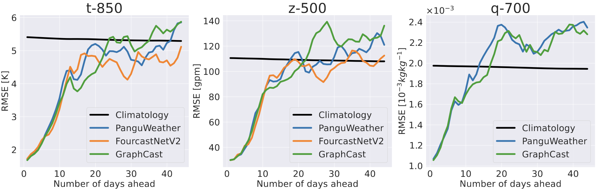

# Motivation
Our benchmark is one of the first to perform large-scale evaluation on existing state-of-the-art models, and finds methods originally developed for weather-scale applications _fails_ on S2S task, including:

1️⃣ __Collapse to Climatology__. Performing comparable or worse than climatology renders these state-of-the-art-models operationally unusable

2️⃣ __Blurring Artifact__. Averaged-out forecasts is of little use when one attempts to predict extreme events requiring high-fidelity on the S2S scale (e.g., droughts, hurricanes)
